  

# Zion Bets: GambleFi on Aptos

## Introduction
Welcome to Zion Bets, a GambleFi project on the Aptos blockchain. Our platform is secured by on-chain randomness, offering a fast, transparent, and verifiable gambling experience.

## Features
- **Non-Custodial:** We never have access to user funds.
- **Transparent:** Users can always see and access our reserves.
- **Verifiable:** Public, unbiased, and verifiable random number generation.
- **Fast:** Ultra-fast betting.
- **Secure:** Audited MOVE contracts with built-in safety features.
- **Smooth Mobile UX:** Play and chat live with friends in a seamless mobile experience.

  

## Modules
The `crash.move` module implements the core functionality of the crash game. It includes the following key functions:
- **initialize_game:** Sets up a new game with initial parameters.
- **place_bet:** Allows users to place bets on the current game.
- **generate_randomness:** Uses on-chain randomness to determine the crash point.
- **end_game:** Ends the current game, calculates outcomes, and distributes winnings.

The `liquidity_pool.move` module manages the liquidity pool for Zion Bets. Key functions include:
- **add_liquidity:** Allows users to add funds to the liquidity pool.
- **remove_liquidity:** Enables users to withdraw their funds from the pool.
- **calculate_payout:** Computes the payout for winning bets based on the current pool size.
- **distribute_fees:** Allocates a portion of game fees to the liquidity pool and the platform.

```mermaid
%%{
  init: {
    'theme': 'base',
    'themeVariables': {
      'primaryColor': '#00FF00',
      'primaryTextColor': '#FFFFFF',
      'primaryBorderColor': '#00FF00',
      'lineColor': '#00FF00',
      'secondaryColor': '#000000',
      'tertiaryColor': '#FFFFFF',
      'tertiaryTextColor': '#00FF00',
      'background': '#000000',
      'mainBkg': '#000000',
      'textColor': '#00FF00',
      'titleColor': '#00FF00',
      'nodeBorder': '#00FF00',
      'clusterBkg': '#000000',
      'clusterBorder': '#00FF00',
      'edgeLabelBackground': 'transparent',
      'edgeLabel': '#FFFFFF'
    }
  }
}%%

graph TD
    subgraph Users
        Admin["Admin"]
        Player["Player"]
        LP["Liquidity Provider"]
    end

    subgraph "Crash Game Module"
        CrashState["State struct<br>- signer_cap: SignerCapability<br>- current_game: Option<Game><br>- Various EventHandles"]
        CrashGame["Game struct<br>- start_time_ms: u64<br>- house_secret_hash: vector<u8><br>- salt_hash: vector<u8><br>- randomness: u64<br>- bets: SimpleMap<address, Bet>"]
        CrashBet["Bet struct<br>- player: address<br>- bet_amount: u64<br>- cash_out: Option<u64>"]
        StartGame["start_game(admin: &signer, house_secret_hash: vector<u8>, salt_hash: vector<u8>)"]
        PlaceBet["place_bet(player: &signer, bet_amount: u64)"]
        CashOut["cash_out(admin: &signer, player: address, cash_out: u64)"]
        RevealCrashPoint["reveal_crashpoint_and_distribute_winnings(salted_house_secret: vector<u8>, salt: vector<u8>)"]
        CalcCrashPoint["calculate_crash_point_with_randomness(randomness: u64, house_secret: String): u64"]
    end

    subgraph "Liquidity Pool Module"
        LPState["State struct<br>- signer_cap: SignerCapability<br>- Various EventHandles"]
        LiquidityPool["LiquidityPool struct<br>- reserve_coin: Coin<ZAPT><br>- locked_liquidity: Coin<LPCoin><br>- lp_coin_mint_cap: MintCapability<LPCoin><br>- lp_coin_burn_cap: BurnCapability<LPCoin>"]
        SupplyLiquidity["supply_liquidity(supplier: &signer, supply_amount: u64)"]
        RemoveLiquidity["remove_liquidity(supplier: &signer, lp_coin_amount: u64)"]
        ExtractReserve["extract_reserve_coins(amount: u64): Coin<ZAPT>"]
        PutReserve["put_reserve_coins(coin: Coin<ZAPT>)"]
    end

    subgraph "Key Variables and Constants"
        ReserveCoin["reserve_coin: Coin<ZAPT><br>(Holds the pool's funds)"]
        CrashPoint["crash_point: u64<br>(Calculated point where the game crashes)"]
        Constants["Constants:<br>SEED: vector<u8><br>MAX_CRASH_POINT: u128<br>COUNTDOWN_MS: u64"]
    end

    %% User Interactions
    Admin -->|Initiates game| StartGame
    Admin -->|Reveals crash point| RevealCrashPoint
    Player -->|Places bet| PlaceBet
    Player -->|Requests cashout| CashOut
    LP -->|Adds liquidity| SupplyLiquidity
    LP -->|Removes liquidity| RemoveLiquidity

    %% Crash Game Relationships
    CrashState -->|Contains| CrashGame
    CrashGame -->|Contains| CrashBet
    StartGame -->|Initializes| CrashGame
    PlaceBet -->|Modifies| CrashGame
    CashOut -->|Modifies| CrashGame
    RevealCrashPoint -->|Uses| CrashGame
    RevealCrashPoint -->|Calls| CalcCrashPoint

    %% Liquidity Pool Relationships
    LPState -->|Contains| LiquidityPool
    LiquidityPool -->|Manages| ReserveCoin

    %% Inter-module Relationships
    PlaceBet -.->|Calls| ExtractReserve
    RevealCrashPoint -.->|Calls| PutReserve

    %% Flow of Funds
    SupplyLiquidity -->|Increases| ReserveCoin
    RemoveLiquidity -->|Decreases| ReserveCoin
    ExtractReserve -->|Extracts from| ReserveCoin
    PutReserve -->|Adds to| ReserveCoin

    %% Key Variables Usage
    CalcCrashPoint -->|Calculates| CrashPoint


    classDef user fill:#00FF00,stroke:#00FF00,stroke-width:2px,color:#000000;
    classDef struct fill:#FFFFFF,stroke:#00FF00,stroke-width:2px,color:#000000;
    classDef function fill:#000000,stroke:#00FF00,stroke-width:2px,color:#00FF00;
    classDef variable fill:#000000,stroke:#00FF00,stroke-width:2px,color:#00FF00;
    classDef legend fill:#000000,stroke:#00FF00,stroke-width:2px,color:#00FF00;
    linkStyle default stroke:#00FF00,stroke-width:2px;
    class Admin,Player,LP user;
    class CrashState,CrashGame,CrashBet,LPState,LiquidityPool struct;
    class StartGame,PlaceBet,CashOut,RevealCrashPoint,CalcCrashPoint,SupplyLiquidity,RemoveLiquidity,ExtractReserve,PutReserve function;
    class ReserveCoin,CrashPoint,Constants variable;
    class L1,L2,L3,L4,L5 legend;
```

